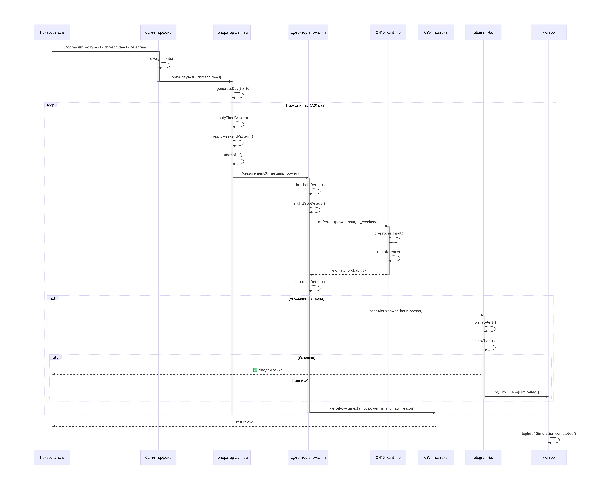
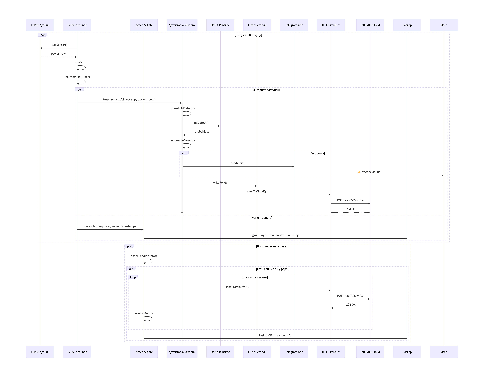

# Архитектура системы

**Модель C4** (от англ. С4 model, Context Container Component Code model, модель «контекст-контейнер-компонент-код») — простой метод графической записи для моделирования архитектуры программных систем. Он основан на структурной декомпозиции системы на контейнеры и компоненты и опирается на существующие методы моделирования, такие как Unified Modeling Language (UML) или ER-модель (ERD), для более детальной декомпозиции архитектурных блоков.

Диаграммы организованы в соответствии с их иерархическим уровнем:

*Диаграммы контекста (уровень 1)*: показывают систему в масштабе ее взаимодействия с пользователями и другими системами;
*Диаграммы контейнеров (уровень 2)*: разбивают систему на взаимосвязанные контейнеры. Контейнер - это исполняемая и развертываемая подсистема;
*Диаграммы компонентов (уровень 3)*: разделяют контейнеры на взаимосвязанные компоненты и отражают связи компонент с другими контейнерами или другими системами;
*Диаграммы кода (уровень 4)*: предоставляют дополнительные сведения о дизайне архитектурных элементов, которые могут быть сопоставлены с программным кодом. Модель C4 на этом уровне опирается на существующие нотации, такие как UML, диаграммы отношений сущностей (ERD) или диаграммы, созданные интегрированными средами разработки (IDE).

## 1. Контекст системы (C4 Level 1)

### Текущая версия (0.1)


*Рисунок 1. Контекст системы — текущая версия (симуляция + CSV + Telegram)*

**Взаимодействия:**
- Пользователь запускает приложение с параметрами
- Система сохраняет результаты в CSV-файл
- При аномалиях отправляет уведомления в Telegram
- Все ошибки пишутся в error.log

### Планируемое расширение (версии 1.0+)


*Рисунок 2. Контекст системы — с реальными датчиками и облачным хранением*

**Новые взаимодействия:**
- ESP32 датчики собирают реальные данные
- Данные сохраняются в InfluxDB Cloud
- CSV остаётся для локального архива

## 2. Контейнеры (C4 Level 2)

### Текущая версия (0.1)


*Рисунок 3. Диаграмма контейнеров — текущая версия (симуляция + ML + Telegram)*

**Состав текущей версии:**

| Контейнер             | Назначение                                                     | Технологии        |
|-----------------------|----------------------------------------------------------------|-------------------|
| **CLI-интерфейс**     | Принимает параметры от пользователя                            | CLI11, C++20      |
| **Генератор данных**  | Создает синтетические данные с учетом времени суток и выходных | `<random>`, C++20 |
| **ONNX Runtime**      | Выполняет ML-модель для детекции аномалий                      | ONNX Runtime      |
| **Детектор аномалий** | Координирует проверку (пороги + ML + ночное падение)           | Логика на C++20   |
| **CSV-писатель**      | Сохраняет результаты анализа в файл                            | `<fstream>`       |
| **Telegram-бот**      | Отправляет уведомления при обнаружении аномалий                | HTTP-клиент (C++) |
| **Логгер**            | Записывает ошибки и события в `error.log`                      | `<fstream>`       |

**Взаимодействия между контейнерами:**

1. **CLI-интерфейс → Генератор данных**: передает параметры 
2. **Генератор данных → Детектор аномалий**: передает сгенерированные данные
3. **Детектор аномалий → ONNX Runtime**: запрос на ML-инференс
4. **ONNX Runtime → Детектор аномалий**: результат ML (аномалия да/нет)
5. **Детектор аномалий → CSV-писатель**: запись результатов
6. **Детектор аномалий → Telegram-бот**: отправка уведомлений
7. **Все контейнеры → Логгер**: запись ошибок и событий

### Планируемое расширение (версии 1.0+)


*Рисунок 4. Диаграмма контейнеров — с реальными датчиками и облаком*

**Новые контейнеры:**

| Контейнер         | Назначение                             | Технологии |
|-------------------|----------------------------------------|------------|
| **ESP32-драйвер** | Опрос реальных датчиков и сбор данных  | C++/ESP-IDF |
| **Буфер данных**  | Локальное хранение при отсутствии сети | SQLite      |
| **HTTP-клиент**   | Отправка данных в облачное хранилище   | libcurl     |

**Ключевые особенности будущей архитектуры:**

1. **Два источника данных**:
   - Генератор данных (для тестирования и отладки)
   - ESP32-драйвер с реальными датчиками

2. **Буферизация**:
   - При отсутствии интернета данные сохраняются в SQLite
   - При восстановлении связи буфер автоматически отправляется

3. **Централизованное логирование**:
   - Все компоненты пишут в общий логгер
   - Ошибки ESP32 и HTTP также логируются

4. **Интеграция с облаком**:
   - Данные отправляются в InfluxDB Cloud через HTTP-клиент
   - Сохраняются теги: комната, этаж, тип датчика

### Планы на версию 2.0 (режим реального времени)

В версии 2.0 планируется добавить:
- **Автоматический режим** — постоянная работа программы
- **Планировщик задач** — анализ каждую минуту
- **Сборщик статистики** — агрегация данных (среднее, пики, тренды)
- **Grafana** — визуализация дашбордов
- **Автозапуск** при старте системы

## 3. Компоненты (C4 Level 3)

### Детектор аномалий

**Компоненты и их ответственность:**

- **RuleEngine**  
  Применяет простые пороговые правила: высокая мощность (>40 кВт в любое время), низкое ночное потребление (<2 кВт с 00:00 до 05:59).  
  Ответственность: детерминированная проверка по фиксированным условиям.

- **MLInference**  
  Формирует скользящее окно из последних значений мощности и вызывает ONNX Runtime для инференса модели.  
  Ответственность: получение вероятности аномалии от машинного обучения.

- **AnomalyAggregator**  
  Сравнивает результаты RuleEngine и MLInference, принимает финальное решение об аномалии и формирует причину (например, «Высокая мощность + ML-подтверждение»).  
  Ответственность: объединение двух подходов и принятие решения.

- **AlertDispatcher**  
  Создаёт понятное текстовое сообщение для уведомления (время, значение, причина, уровень критичности).  
  Ответственность: подготовка человеко-читаемого оповещения.

- **ResultExporter**  
  Форматирует все измерения и метки аномалий в строки для записи в CSV (timestamp, power_kw, is_anomaly_rule, is_anomaly_ml, reason).  
  Ответственность: подготовка машиночитаемого экспорта.

**Связи с другими контейнерами:**  
- Выход → Telegram-бот (при подтверждённой аномалии)  
- Выход → CSV-писатель (всегда, полный набор данных)  
- Ошибки и события → Логгер

### Генератор данных

Контейнер для создания воспроизводимых синтетических данных, которые имитируют реальное поведение общежития.

**Компоненты и их ответственность:**

- **TimeProfileProvider**  
  Определяет базовый уровень потребления в зависимости от часа суток (ночь, утро, день, вечер) и дня недели.  
  Ответственность: расчёт ожидаемого среднего значения без шума.

- **NoiseGenerator**  
  Добавляет случайный шум по нормальному распределению (среднее = 0, стандартное отклонение ≈ 2.5 кВт).  
  Ответственность: имитация естественных колебаний потребления.

- **WeekendAdjuster**  
  Уменьшает утренние и вечерние пики в субботу и воскресенье (коэффициенты 0.6–0.7).  
  Ответственность: учёт изменения поведения жителей в выходные.

- **TimestampCalculator**  
  Генерирует последовательные временные метки, реалистично привязанные к текущему времени (или к заданной точке).  
  Ответственность: присвоение правильного времени каждому измерению.

- **DataAssembler**  
  Собирает все части (базовый уровень + шум + корректировка + метка времени) в структуру Measurement и формирует полный вектор SimulationData.  
  Ответственность: финальная сборка результата.

**Связи с другими контейнерами:**  
- Выход → Детектор аномалий (передача готового SimulationData)  
- Ошибки → Логгер

### ESP32-драйвер (планируемый контейнер, версия 1.0+)

Контейнер для сбора данных с реальных датчиков (будущая часть системы).

**Компоненты и их ответственность:**

- **Polling / MQTT клиент**  
  Периодически опрашивает датчики (по Modbus, I2C, ADC) или принимает данные по MQTT.  
  Ответственность: получение сырых данных от оборудования.

- **Parser**  
  Преобразует полученные байты или сообщения в унифицированную структуру Measurement (timestamp, power_kw, температура и т.д.).  
  Ответственность: приведение данных к общему формату.

- **Tagger**  
  Добавляет контекстные метки: номер комнаты, этаж, тип датчика, идентификатор устройства.  
  Ответственность: обогащение данных для последующего анализа и хранения.

- **Buffer**  
  При отсутствии интернета временно сохраняет данные в локальную SQLite-базу.  
  Ответственность: обеспечение надёжности передачи при нестабильной связи.

**Связи с другими контейнерами / системами:**  
- Вход ← ESP32-датчики (внешние устройства)  
- Выход → Детектор аномалий (реальные измерения)  
- Выход → Буфер → HTTP-клиент → InfluxDB Cloud  
- Ошибки → Логгер

## 4. Потоки данных

### Основной поток — текущая версия (симуляция)



*Рисунок 4. Диаграмма последовательности для версии 0.2 (симуляция)*

**Описание потока:**

1. **Запуск** 

2. **Обработка параметров** — CLI-интерфейс (CLI11) разбирает аргументы

Параметры упаковываются в структуру `Config` и передаются в Генератор данных.

3. **Генерация данных** — Генератор создаёт почасовые измерения за указанный период:

4. **Детекция аномалий** — для каждого измерения:
   - **RuleEngine** проверяет пороговые правила
   - **MLInference**:
     * Подготавливает входные данные (нормализация, добавление контекста)
     * Вызывает ONNX Runtime для получения вероятности аномалии
   - **AnomalyAggregator**:
     * Собирает результаты (2-3 голоса)
     * Принимает финальное решение (аномалия если ≥ 2 методов)
     * Формирует причину (например: "перегрузка + ML")

5. **Уведомление** (если аномалия подтверждена):
   - **AlertDispatcher** создаёт читаемое сообщение
   - Telegram-бот отправляет его в настроенный чат
   - При ошибке отправки (нет интернета) — запись в лог

6. **Сохранение** — все данные передаются в **ResultExporter**:
   - CSV-писатель сохраняет каждую запись в файл
   - Формат: `timestamp,power_kw,is_anomaly_rule,is_anomaly_ml,reason`

7. **Логирование** — на всех этапах при ошибках или важных событиях:
   - Запись в `error.log` через централизованный Логгер
   - Информационные сообщения о прогрессе (при `--verbose`)

**Особенности потока:**
- Синхронное выполнение — все операции в одном потоке
- Детерминированность — при одинаковом seed результаты воспроизводимы
- Нет сетевых зависимостей (кроме Telegram, который опционален)
- Все компоненты stateless — состояние не сохраняется между запусками

### Планируемый поток (версия 1.0+)



*Рисунок 5. Диаграмма последовательности для версии 1.0+ (реальные датчики)*

**Описание потока:**

1. **Сбор данных** — ESP32-драйвер работает в непрерывном режиме:
   - Каждые 60 секунд опрашивает подключённые датчики
   - Или получает данные по MQTT при их публикации

2. **Обработка сырых данных**:

3. **Буферизация** — критически важный этап для надёжности:
   - **Если интернет доступен:** данные сразу передаются в Детектор
   - **Если интернет отсутствует:** данные сохраняются в SQLite-буфер
   - В буфере хранятся: timestamp, мощность, теги, флаг синхронизации

4. **Детекция аномалий** (аналогично симуляции):
   - Применяются пороговые правила
   - Вызывается ML-модель через ONNX Runtime
   - Принимается решение (ensemble)

5. **Реакция на аномалию**:
   - **AlertDispatcher** формирует уведомление
   - Telegram-бот отправляет сообщение (если есть интернет)
   - (В будущем) возможна отправка сигнала на реле для отключения

6. **Сохранение данных** — два параллельных пути:
   - **Локально:** CSV-писатель сохраняет все измерения (архив)
   - **В облако:** HTTP-клиент отправляет данные в InfluxDB Cloud

7. **Восстановление связи** (если была буферизация):
   - Проверяется наличие неотправленных данных в SQLite
   - Автоматически отправляются все накопленные записи
   - После подтверждения — помечаются как синхронизированные

8. **Логирование** — все компоненты пишут в центральный логгер:
   - Ошибки датчиков (например, "sensor 0x77 not responding")
   - Сбои сети (таймауты, недоступность)
   - Информация о буферизации (сколько записей в очереди)

**Особенности потока:**
- Асинхронный режим — программа работает как демон/сервис
- Буферизация гарантирует сохранность данных при сбоях
- Два источника могут работать параллельно (реальные данные + симуляция для тестов)
- Автоматическая retry-логика с экспоненциальной задержкой
- Graceful degradation — при отказе любого компонента система продолжает работу

### Общие принципы потоков данных

1. **Формат данных** — все компоненты используют единую структуру:
   ```cpp
   struct Measurement {
       time_t timestamp;     // Unix time
       double power_kw;      // мощность
       int room_id;          // номер комнаты
       int floor;            // этаж
       bool is_anomaly;      // флаг
       string reason;        // причина 
   };
   ```

2. **Stateless компоненты** — каждый компонент получает входные данные и возвращает результат, не сохраняя внутреннее состояние между вызовами.

3. **Слабая связанность** — компоненты знают только интерфейсы друг друга, не детали реализации.

4. **Единый логгер** — все ошибки и события проходят через централизованную систему логирования.

5. **Детерминизм** — симуляция всегда воспроизводима при одинаковом seed.

6. **Graceful degradation** — при сбоях второстепенных компонентов (Telegram, облако) основная функциональность сохраняется.

## 5. Ключевые архитектурные решения

📌 Детальные обоснования решений вынесены в отдельную папку `docs/adr/` (Architecture Decision Records).